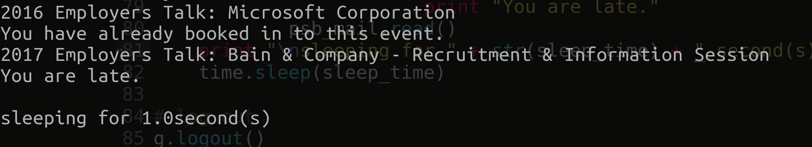

# py-UnimelbCareerAutoBookin

unimelb careersonline auto book-in using python.

## Getting Started

### Prerequisite

+ python2
+ [GMail for Python](https://github.com/charlierguo/gmail) module

### Usage

* fill the _student login name_, _password_ and _sleep-time_ in `config.json`. (not needed if you choose to input those in the console directly)
* Run `UoMCABI.py` then.

### Screenshot

## Known bugs/issues

+ have to turn off the __Access for less secure apps__ in google account
+ student email does not support OAuth, which leads to the explict use of the password

## License

This project is licensed under the GPL License - see the
[LICENSE.md](LICENSE.md) file for details.

## Acknowledgments

* [Charlie Guo](https://github.com/charlierguo/)